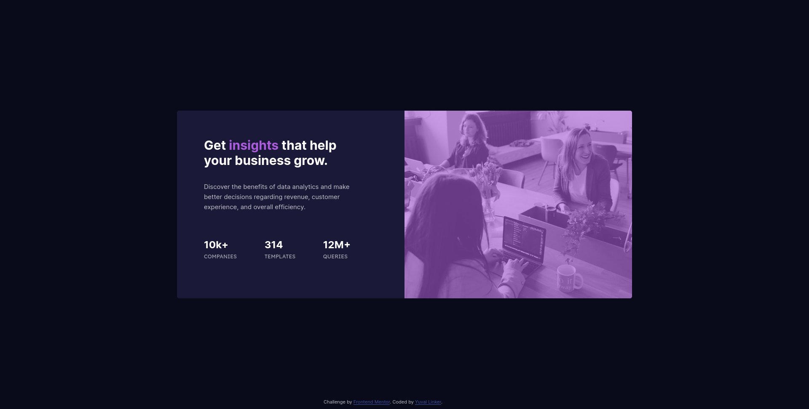

# Frontend Mentor - Stats preview card component solution

This is a solution to the [Stats preview card component challenge on Frontend Mentor](https://www.frontendmentor.io/challenges/stats-preview-card-component-8JqbgoU62). Frontend Mentor challenges help you improve your coding skills by building realistic projects. 

## Table of contents

- [Frontend Mentor - Stats preview card component solution](#frontend-mentor---stats-preview-card-component-solution)
  - [Table of contents](#table-of-contents)
  - [Overview](#overview)
    - [The challenge](#the-challenge)
    - [Screenshot](#screenshot)
    - [Links](#links)
  - [My process](#my-process)
    - [Built with](#built-with)
    - [What I learned](#what-i-learned)
    - [Continued development](#continued-development)
    - [Useful resources](#useful-resources)
  - [Author](#author)

**Note: Delete this note and update the table of contents based on what sections you keep.**

## Overview

### The challenge

Users should be able to:

- View the optimal layout depending on their device's screen size

### Screenshot

Desktop Version


Mobile Version


### Links

- Solution URL: [Add solution URL here](https://your-solution-url.com)
- Live Site URL: [Add live site URL here](https://your-live-site-url.com)

## My process

### Built with

- Semantic HTML5 markup
- CSS custom properties
- Flexbox
- CSS Grid
- Mobile-first workflow
- Sass

### What I learned

I learned a lot of CSS. I learned how to change the color of an image only by using CSS with this trick

```css
.filtered-img {
  -webkit-filter: grayscale(100%);
  filter: grayscale(100%);
  opacity: 0.4;
}

.img-background {
  background-color: violet;
}
```

Also, i learned how to use the `@media` query to make responsive components. Since this is my first frontend mentor challenge i has to setup Sass to preprocess my css to make it easier for me to write styles.

Finally, I learned about this cool trick to center content by using the `transform` CSS property
```css
.centered-content {
  position: absolute;
  top: 50%;
  left: 50%;
  -webkit-transform: translate(-50%, -50%);
  transform: translate(-50%, -50%);
}
```

Although, it can be easier by just putting `margin: auto`

### Continued development

I need to be more comfortable with using relative metrics (not pixels for example), so that my components are more responsive and never look bad. 

**Note: Delete this note and the content within this section and replace with your own plans for continued development.**

### Useful resources

- [Sass documentation](https://sass-lang.com/documentation) - The Sass documentation helped me to familiarize myself with the language.

## Author

- Website - [Yuval Linker](https://github.com/yuval-linker)
- Frontend Mentor - [@yuval-linker](https://www.frontendmentor.io/profile/yuval-linker)
